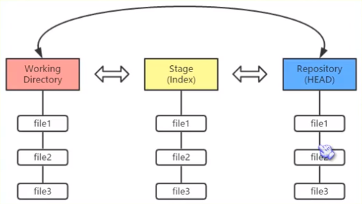
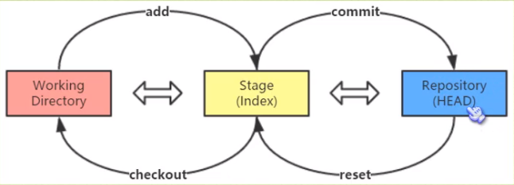

# 1.什么是Git

# 2. 初次使用Git

1. 安装Git。

2. 在命令行模式里输入以下命令

   > - git config --global user.name "用户名"
   >
   > - git config --global user.email "密码"

3. 了解Git的工作原理

   

- Git的工作流程一般是这样子的：
  1. 在工作目录中添加、修改文件
  2. 将需要进行版本管理的文件放入暂存区域
  3. 将暂存区域的文件提交到Git仓库

- Git管理的文件有三种状态:
  1. 已修改 (modified)
  2. 已暂存 (staged)
  3. 已提交 (committed)

- 将工作目录的文件放到Git仓库只需要三步：
  1. git init
  2. git add filename
  3. git commit -m "提交备注"

- Reset 和 Checkout

  


# Git 命令大全

1. 初始化仓库

```markdown
# 初始化仓库
git init
# 添加本地文件到stage
git add .
git add filename
git add -A (把新增、修改和删除的都加入)
# 提交
git commit -m "备注"
git commit -am "版本描述" (一步完成提交)
# 推送到Repository
git push
git push -u origin master
# 查看Git状态
git status
# 显示当前远程仓库地址
git remote -v
# 修改远程仓库地址
git remote set-url origin git@github.com:Panan911/Study.git
# 创建新分支
git branch newbranch
# 查看分支是否成功
git branch
# 切换到新分支
git checkout newbranch
# 切换到主分支
git checkout master
# 将新分支提交的改动合并到主分支上
git merge newbranch
# 删除新的分支
git branch -D newbranch
# 拉取远程代码
git clone git@github.com:Panan911/Study.git
# 拉取远程指定分支下代码(-b 分支名称)
git clone -b v2.8.1 git@github.com:Panan911/Study.git
# 查看git配置信息
git conifg -l
# 配置用户名和密码
git config --global user.name "用户名"
git config --global user.email "密码"
# 恢复操作
git reset HEAD
git reset HEAD~ (回滚到上次版本)
git reset --mixed HEAD~
 - 移动HEAD的指向，将其指向上一行暂照 
 - 将HEAD移动后指向的快照回滚到暂存区域
```


# 一些报错的解决方案

> 1. Updates were rejected because the remote contains work that you do

```markdown
1. git init //初始化仓库

2. git add .(文件name) //添加文件到本地仓库

3. git commit -m "first commit" //添加文件描述信息

4. git remote add origin + 远程仓库地址 //链接远程仓库，创建主分支

5. git pull origin master // 把本地仓库的变化连接到远程仓库主分支

6. git push -u origin master //把本地仓库的文件推送到远程仓库
```


```markdown
如何解决failed to push some refs to git
出现错误的主要原因是github中的README.md文件不在本地代码目录中

可以通过如下命令进行代码合并【注：pull=fetch+merge]
git pull --rebase origin master

执行上面代码后可以看到本地代码库中多了README.md文件
此时再执行语句 git push -u origin master即可完成代码上传到github
```